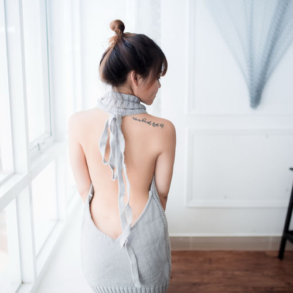
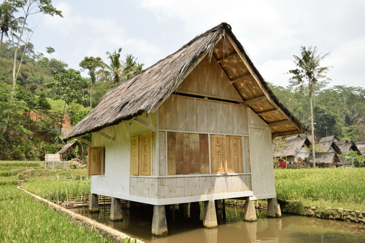
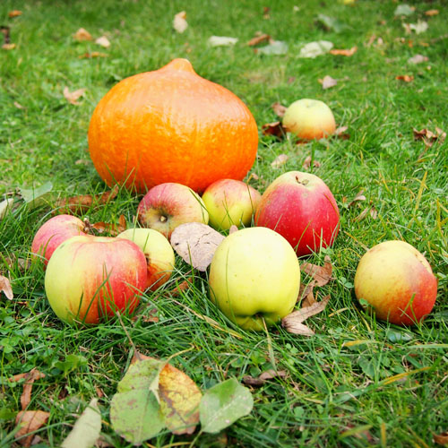
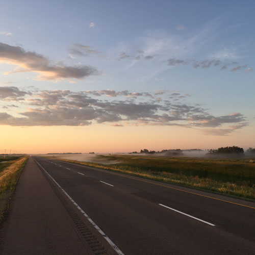

<!DOCTYPE html>
<html lang="en" class="no-js">
<head>
<meta charset="UTF-8" />
<meta name="viewport" content="width=device-width, initial-scale=1">
<title>图片瀑布</title>
<link rel="shortcut icon" type=image/png href=https://i.328888.xyz/2023/03/01/zv9Hw.png>

<!---<link href="https://fonts.googleapis.com/css?family=Roboto+Mono:300,500,700" rel="stylesheet">--->

<!-- <link rel="stylesheet" type="text/css" href="sponsor/pater.css" /> -->

</head>
<body class="loading">

<main>
	<header class="codrops-header"></header>
	

		

			switch layout
			

				<input class="control__radio" type="radio" name="grid-type" value="grid--type-a" id="control-grid-a" checked>
				<label class="control__label" for="control-grid-a">grid A</label>
			

			

				<input class="control__radio" type="radio" name="grid-type" value="grid--type-b" id="control-grid-b">
				<label class="control__label" for="control-grid-b">grid B</label>
			

			

				<input class="control__radio" type="radio" name="grid-type" value="grid--type-c" id="control-grid-c">
				<label class="control__label" for="control-grid-c">grid C</label>
			

		
	
	

	

		

			run effect
			<button class="control__btn" data-fx="Hapi">Hapi</button>
			<button class="control__btn" data-fx="Amun">Amun</button>
			<button class="control__btn" data-fx="Kek">Kek</button>
			<button class="control__btn" data-fx="Isis">Isis</button>
			<button class="control__btn" data-fx="Montu">Montu</button>
			<button class="control__btn" data-fx="Osiris">Osiris</button>
			<button class="control__btn" data-fx="Satet">Satet</button>
			<button class="control__btn" data-fx="Atum">Atum</button>
			<button class="control__btn" data-fx="Ra">Ra</button>
			<button class="control__btn" data-fx="Sobek">Sobek</button>
			<button class="control__btn" data-fx="Ptah">Ptah</button>
			<button class="control__btn" data-fx="Bes">Bes</button>
			<button class="control__btn" data-fx="Seker">Seker</button>
			<button class="control__btn" data-fx="Nut">Nut</button>
			<button class="control__btn" data-fx="Shu">Shu</button>
		

	

	

		

			

			

				
			

			

				
			

			

				<a class="grid__link pater" href="http://synd.co/2oQTgFH">
					

					

						<h2 class="pater__title" aria-label="fullstory">See Every Click, Swipe,   and Scroll</h2>
						
See how users experience your designs with FullStory.

						Get it free today!
					

				</a>
			

			

				
			

			

				
			

			

				
			

			

				
			

			

				
			

			

				
			

			

				
			

			

				
			

			

				
			

			

				
			

			

				
			

			

				
			

			

				
			

			

				
			

		

		

			

			

				
			

			

				
			

			

				<a class="grid__link pater pater--small" href="http://synd.co/2oQTgFH">
					

					

						<h2 class="pater__title" aria-label="fullstory">See Every Click, Swipe,   and Scroll</h2>
						
See how users experience your designs with FullStory.

						Get it free today!
					

				</a>
			

			

				
			

			

				
			

			

				
			

			

				
			

			

				
			

			

				
			

			

				
			

			

				
			

			

				
			

			

				
			

			

				
			

			

				
			

			

				
			

			

				
			

			

				
			

			

				
			

			

				
			

			

				
			

			

				
			

			

				
			

			

				
			

			

				
			

			

				
			

		

		

			

			

				
			

			

				
			

			

				<a class="grid__link pater" href="http://synd.co/2oQTgFH">
					

					

						<h2 class="pater__title" aria-label="fullstory">See Every Click, Swipe,   and Scroll</h2>
						
See how users experience your designs with FullStory.

						Get it free today!
					

				</a>
			

			

				
			

			

				
			

			

				
			

			

				
			

			

				
			

			

				
			

			

				
			

			

				
			

			

				
			

			

				
			

			

				
			

			

				
			

			

				
			

			

				
			

			

				
			

			

				
			

		

	

	
</main>

</body>
</html>
